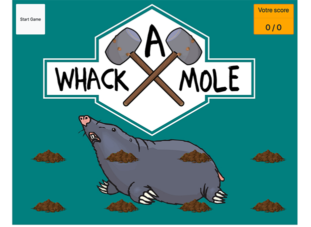

# Wack A Mole
Vous avez ici un petit jeu facile à réaliser, voici le résultat à atteindre.

La carcasse HTML (index.html) est faite, il n'y a **absolument** rien à changer à l'intérieur.

Les images nécessaires sont dans le dossier img.

## Travail à fournir
* Completer le fichier app.css
* Commenter l'intégralité du fichier app.js
* Modifier la vitesse d'affichage/disparition de la taupe

## Pour vous détendre entre deux lignes de code
* Jouer à Whack A Mole
